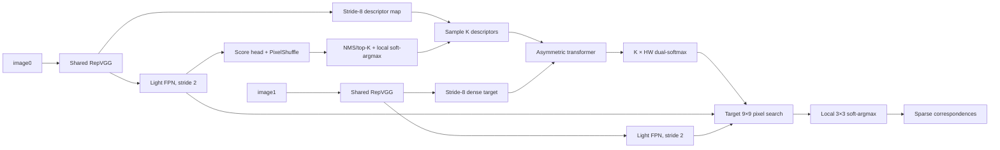

# 구현된 모델

기본형은 eLoFTR의 RepVGG training backbone을 공유하며 stride 2/4/8의
64/128/256-channel feature를 사용한다. 동일 크기 영상은 backbone에서 batch로
묶어 처리한다. ALIKE backbone를 별도로 실행하지 않는다.

## Backbone와 detector

- RepVGG stage depth는 기본 `[2,4,14]`이며 eLoFTR training checkpoint의
  `backbone.layer*` 이름과 tensor shape를 보존한다. 작은 smoke 모델의
  `[1,1,1]`은 실행 검증용이며 원본 backbone 재현 모델이 아니다.
- FPN은 lateral projection + depthwise/pointwise convolution을 사용한다.
  descriptor fine map은 stride 2, 64 channels에 유지한다. 전체 영상에
  full-resolution 64/128-channel descriptor map을 만드는 비용을 피한다.
- score head는 stride-2 map에서 PixelShuffle로 full-resolution score를 만든다.
  단순 bilinear score upsampling과 달리 2×2 각 pixel phase를 별도로 예측한다.
- NMS/top-K는 detached discrete selection이다. 선택된 위치 주변 5×5 score의
  soft-argmax, score sampling, descriptor sampling은 미분 가능하다.
- K는 최대 예산이다. 유효한 NMS peak가 부족하면 빈 slot을 validity mask로
  표시한다. 계산 tensor는 고정 K slot을 유지하므로 실제 peak가 줄어도 자동으로
  연산량이 줄어들지는 않는다.
- target detector는 학습/validation loss 계산에서만 실행한다. 일반 `eval()`
  추론에서는 target keypoint를 검출하지 않는다.

## Transformer와 coarse matching

각 층은 sparse source self-attention, pooled target self-attention, 양쪽
cross-attention으로 구성한다. 기본 4회 반복, channel 256, 8 heads이다.
Target stride-8 map은 4×4로 mask-aware pooling하며, message를 bilinear로
dense grid에 되돌린다. 832²에서는 target context가 26×26이다.
attention은 PyTorch SDPA를 사용한다. CUDA FlashAttention 실제 dispatch 여부는
환경과 mask 조건에 따라 달라지며 이 구현이 항상 Flash kernel을 쓴다고 보장하지 않는다.

Self-attention에는 실제 연속 pixel 좌표의 2-D RoPE를 적용한다. cross-attention은
eLoFTR처럼 absolute coordinate rotation을 적용하지 않는다. ALIKE score는
soft-argmax 위치를 거쳐 matching loss에 연결되지만 hard top-K membership 자체는
미분되지 않는다. 따라서 제한 K에 대한 완전한 differentiable selection algorithm은 아니다.

최종 cosine similarity는 `K × (H1/8 W1/8)`이며 양 축 log-softmax의 합으로
dual confidence를 만든다. source row/target column mutual maxima를 선택한다.
FP32 correlation/normalization을 강제하고, threshold는 기본 0.01이지만
**아직 calibration되지 않은 연구 시작값**이다. eLoFTR threshold를 그대로 옮길 수 없다.

`coarse_chunk_size=0`은 기본으로 전체 K×HW 행렬을 한 번 계산한다.
양수이면 inference에서 exact dual-softmax를 target chunk 단위로 두 번 계산하여
full confidence 저장을 피한다. 이는 메모리 절약 선택이며 추가 연산을 한다.
full/streaming 동일성은 테스트했지만 어느 쪽이 빠른지는 GPU에서 측정해야 한다.

## Fine refinement

source 좌표는 ALIKE detector의 subpixel 위치로 고정한다. target coarse cell
중심 주변 9×9 pixel 위치에서 stride-2 fine map을 bilinear sampling하여
pixel-level classification을 한다. 선택된 pixel 주변 3×3에서 별도 projection과
soft-argmax로 subpixel 위치를 얻는다. source fine descriptor에는 transformer의
query context가 더해진다. 필요한 patch만 sampling하고 dense full-image unfold는 하지 않는다.

이는 eLoFTR의 두 단계 fine matching에서 착안한 **source point → target window
변형**이다. 원본 eLoFTR의 두 patch 사이 dual-softmax 및 양쪽 pixel 선택과 수치적으로
동일하지 않으며 pretrained fine matcher 가중치를 그대로 사용할 수 없다.
stride-2 fine feature의 보간으로 충분한 정밀도를 얻는지는 실험해야 한다.

학습 fine crop은 예측 match와 GT coarse cell을 섞는다. 기본 최대 512개 중
최대 256개를 예측에서 뽑고, 부족한 수는 유효 GT로 채운다. `train_gt_fraction=0`이면
GT injection을 끄고 예측 crop만 사용한다. source 좌표는 그대로다.
일반 추론은 GT를 읽지 않는다. `forward(..., return_training_outputs=True)`는
eval mode에서도 GT crop과 target detector를 켜는 **loss validation 전용** API다.
그 반환 match로 accuracy/localization을 평가하면 안 된다.

## 좌표 및 pretrained 범위

모든 좌표는 `(x,y)` pixel center이다. 영상 width W에서
`u = 2*(x+0.5)/W-1`; inverse는 `x=(u+1)*W/2-0.5`이다.
stride-8 feature cell j의 명시적 영상 좌표는 `(j+0.5)*8-0.5`이다.
이는 interpolation lattice 정의이며 strided convolution의 raw receptive-field
center가 이동한다는 뜻은 아니다. detector sampling, coarse GT, fine window,
resize intrinsics와 homography 모두 이 정의를 공유한다. eLoFTR의 integer-origin
coarse convention과 차이가 있으므로 pretrained backbone만 불러오고 전체 모델은 학습한다.

입력은 float grayscale `[B,1,H,W]`이고 H/W를 32 배수로 오른쪽/아래 padding한다.
양쪽 영상 크기는 달라도 되며 mask는 원래 유효 영역만 참이다. 출력 NPZ 좌표는
resize 역변환을 거친 원본 영상 pixel이다. 모든 grid sampling은 AMP에서도
FP32 좌표로 수행한다.

## 아직 입증되지 않은 점

실제 dataset 학습이나 GPU 비교 결과는 포함되어 있지 않다. eLoFTR 정확도 유지,
LightGlue보다 높은 localization 성능, target 저텍스처 개선은 모두 가설이다.
고정 SfM observation을 외부 source query로 받는 API, database feature cache,
학습된 unmatched/quality head, budget-aware selector는 현재 구현 범위에 없다.
시작점으로 이 모델을 평가한 후 ablation 근거로 추가하는 것이 타당하다.
